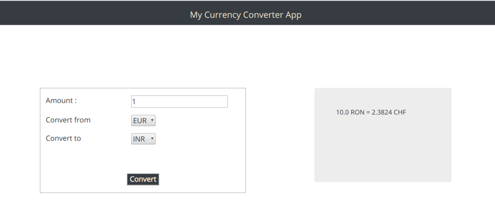
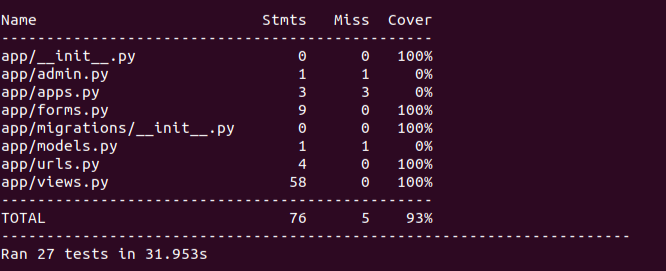

# Currency Converter Application
The application should use the public api (https://api.exchangeratesapi.io/latest) to convert the current conversion rate between any two currencies that you select.

## Application screenshot

## Application structure
The application should have following components:

### Input Form (CurrencyForm): 
This from takes input from the user and send this input to the convert view. The user should take special care to perform validations for all the fields in the form. Also, initialization of the select component should be done. Use Django forms to implement this functionality.

### Currency conversion view (convert)
Currency conversion view is responsible to process the form fields and return a result. In this case the form fields will specify the amount and name of the currencies (TO and FROM) for the conversion. All the exceptions and edge cases related to missing data and HTTPError should be handled in the view. 

## Passing criteria
The application should convert the amount from source currency to target currency.

### The application can be evaluated based on the milestones mentioned below,
          1. Write a function get_currency that takes no argument and returns a list of all the available currencies
          2. Base currency is "EUR". Add the base currency to the list of available currencies
          3. Fill all the currency values in the select boxes
          4. Write a function to convert a currency from one type to other
          5. Show the results on the frontend
## Solution:
The below mentioned steps are for Ubuntu. The user will have to perform minor modifications to install the app on other platforms
### Installation

The application requires Python 3 to run.
Install python 3 from https://realpython.com/installing-python/


virtual environment is a part of standard library for python3. 

Clone the application 
```sh
$ git clone  https://github.com/adideshp/my_curr_converter.git
```


Follow the installation steps as mentioned below,
```sh
$ python3.6 -m venv <NAME_OF_THE_ENVIRONMENT> 
$ source <NAME_OF_THE_ENVIRONMENT>/bin/activate
```
Above mentioned commands create a virtual-env named <NAME_OF_THE_ENVIRONMENT> (This is a custom name). Second command activates the virtual env. Virtual environment creates a isolated environment for all the package installation.

Install all the packages listed in requirements.txt. Follow the steps below,
```sh
$ cd my_curr_converter
$ pip install -r requirements.txt
```

Although the app does not interact with the database you can run all the migrations as follows,
```sh
$ python manage.py migrate
```

The app needs a active internet connection to work as it interacts with the online APIs.

### Starting the application
The application can be started by executing the command below. The app starts at http://localhost:8000

```sh
$ python manage.py runserver
```

### Test Coverage

